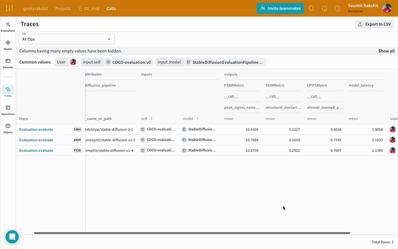

# Hemm: Holistic Evaluation of Multi-modal Generative Models

Hemm is a library for performing comprehensive benchmark of text-to-image diffusion models on image quality and prompt comprehension integrated with [Weights & Biases](https://wandb.ai/site) and [Weave](https://wandb.github.io/weave/). Hemm is inspired by [Holistic Evaluation of Text-To-Image Models](https://crfm.stanford.edu/helm/heim/v1.0.0/).

> [!IMPORTANT]  
> The ownership of Hemm has been turned over to the [Weights & Biases](https://github.com/wandb) organization. All development will henceforth continue on https://github.com/wandb/Hemm and docs will be visible on https://wandb.github.io/Hemm/ and https://github.com/soumik12345/Hemm is hereby archived.

## Installation

```shell
git clone https://github.com/soumik12345/Hemm
cd Hemm
pip install -e ".[core]"
```

## Quickstart

First let's publish a small subset of the MSCOCO validation set as a [Weave Dataset](https://wandb.github.io/weave/guides/core-types/datasets/).

```python
import weave
from hemm.utils import publish_dataset_to_weave

weave.init(project_name="t2i_eval")

dataset_reference = publish_dataset_to_weave(
    dataset_path="HuggingFaceM4/COCO",
    prompt_column="sentences",
    ground_truth_image_column="image",
    split="validation",
    dataset_transforms=[
        lambda item: {**item, "sentences": item["sentences"]["raw"]}
    ],
    data_limit=5,
)
```

|  | 
|:--:| 
| [Weave Datasets](https://wandb.github.io/weave/guides/core-types/datasets/) enable you to collect examples for evaluation and automatically track versions for accurate comparisons. Easily update datasets with the UI and download the latest version locally with a simple API. |

Next, you can evaluate Stable Diffusion 1.4 on image quality metrics as shown in the following code snippet:

```python
import wandb
import weave

from hemm.eval_pipelines import BaseWeaveModel, EvaluationPipeline
from hemm.metrics.image_quality import LPIPSMetric, PSNRMetric, SSIMMetric

# Initialize Weave and WandB
wandb.init(project="image-quality-leaderboard", job_type="evaluation")
weave.init(project_name="image-quality-leaderboard")

# Initialize the diffusion model to be evaluated as a `weave.Model` using `BaseWeaveModel`
model = BaseWeaveModel(diffusion_model_name_or_path="CompVis/stable-diffusion-v1-4")

# Add the model to the evaluation pipeline
evaluation_pipeline = EvaluationPipeline(model=model)

# Add PSNR Metric to the evaluation pipeline
psnr_metric = PSNRMetric(image_size=evaluation_pipeline.image_size)
evaluation_pipeline.add_metric(psnr_metric)

# Add SSIM Metric to the evaluation pipeline
ssim_metric = SSIMMetric(image_size=evaluation_pipeline.image_size)
evaluation_pipeline.add_metric(ssim_metric)

# Add LPIPS Metric to the evaluation pipeline
lpips_metric = LPIPSMetric(image_size=evaluation_pipeline.image_size)
evaluation_pipeline.add_metric(lpips_metric)

# Evaluate!
evaluation_pipeline(dataset="COCO:v0")
```

|  | 
|:--:| 
| The evaluation pipeline will take each example, pass it through your application and score the output on multiple custom scoring functions using [Weave Evaluation](https://wandb.github.io/weave/guides/core-types/evaluations). By doing this, you'll have a view of the performance of your model, and a rich UI to drill into individual ouputs and scores. |