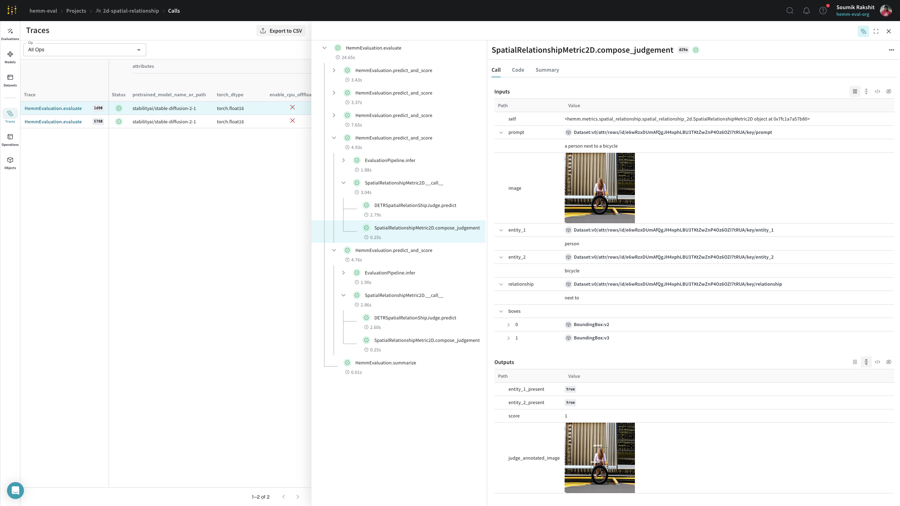

# Spatial Relationship Metrics

This module aims to implement the Spatial relationship metric described in section 3.2 of [T2I-CompBench: A Comprehensive Benchmark for Open-world Compositional Text-to-image Generation](https://arxiv.org/pdf/2307.06350.pdf).

|  | 
|:--:| 
| Using an object-detection model for spatial relationship evaluation as proposed in [T2I-CompBench](https://arxiv.org/pdf/2307.06350.pdf) |

|  | 
|:--:| 
| Weave gives us a holistic view of the evaluations to drill into individual ouputs and scores. |


??? example
    ```python
    import wandb
    import weave

    from hemm.eval_pipelines import BaseDiffusionModel, EvaluationPipeline
    from hemm.metrics.image_quality import LPIPSMetric, PSNRMetric, SSIMMetric

    # Initialize Weave and WandB
    wandb.init(project="image-quality-leaderboard", job_type="evaluation")
    weave.init(project_name="image-quality-leaderboard")

    # Initialize the diffusion model to be evaluated as a `weave.Model` using `BaseWeaveModel`
    model = BaseDiffusionModel(diffusion_model_name_or_path="CompVis/stable-diffusion-v1-4")

    # Add the model to the evaluation pipeline
    evaluation_pipeline = EvaluationPipeline(model=model)

    # Define the judge model for 2d spatial relationship metric
    judge = DETRSpatialRelationShipJudge(
        model_address=detr_model_address, revision=detr_revision
    )

    # Add PSNR Metric to the evaluation pipeline
    metric = SpatialRelationshipMetric2D(judge=judge, name="2d_spatial_relationship_score")
    evaluation_pipeline.add_metric(metric)

    # Evaluate!
    evaluation_pipeline(dataset="t2i_compbench_spatial_prompts:v0")
    ```


:::hemm.metrics.spatial_relationship.spatial_relationship_2d

:::hemm.metrics.spatial_relationship.judges
